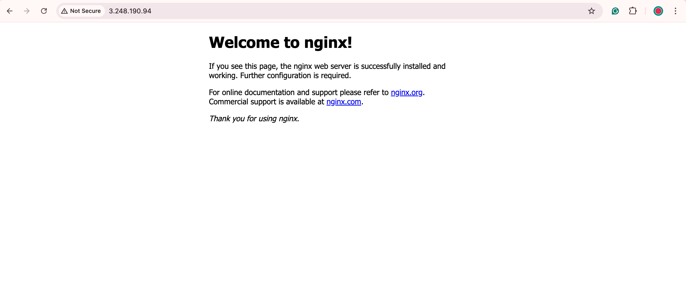
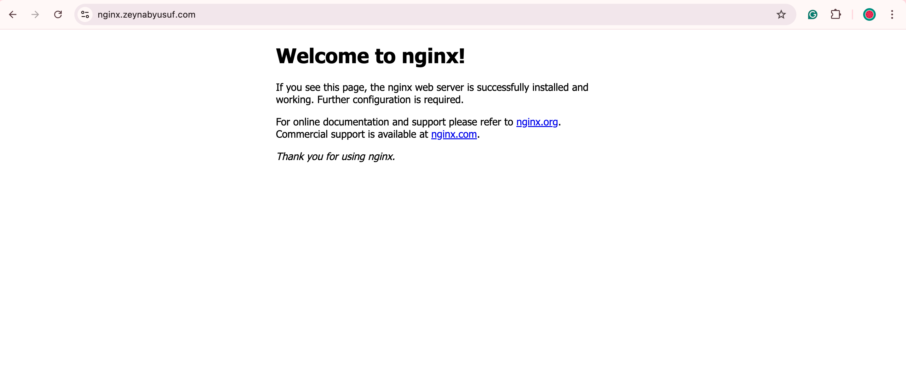
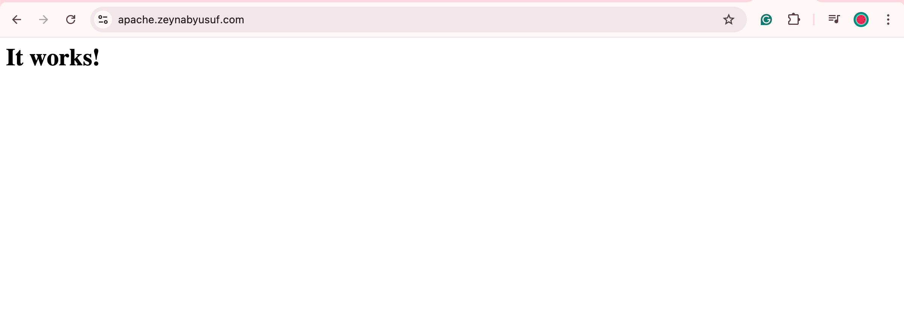

# **Cloudflare Domain with Nginx and Apache on AWS EC2**

**A demonstration of hosting two web servers (Nginx and Apache) on AWS EC2 instances, with DNS routing using Cloudflare.**

---

## **Project Overview**

This project showcases a real-world simulation of setting up multiple web servers on Amazon Web Services (AWS) EC2 instances, while managing domain routing via Cloudflare. 

In this task, I purchased a domain through Cloudflare and created two EC2 instances: one running **Nginx** and another running **Apache**. Both servers were made publicly accessible on port 80 (HTTP) via subdomains.

---

## **Table of Contents**

- [**Cloudflare Domain with Nginx and Apache on AWS EC2**](#cloudflare-domain-with-nginx-and-apache-on-aws-ec2)
  - [**Project Overview**](#project-overview)
  - [**Table of Contents**](#table-of-contents)
  - [**Technologies Used**](#technologies-used)
  - [**What is DNS Routing?**](#what-is-dns-routing)
    - [**Why is DNS Routing Important?**](#why-is-dns-routing-important)
  - [**Step-by-Step Setup**](#step-by-step-setup)
    - [**1. Purchase Domain via Cloudflare**](#1-purchase-domain-via-cloudflare)
    - [**2. Create and Configure Nginx on EC2**](#2-create-and-configure-nginx-on-ec2)
      - [**EC2 Instance Setup (Nginx)**](#ec2-instance-setup-nginx)
  - [**3. Create and Configure Apache on EC2**](#3-create-and-configure-apache-on-ec2)
    - [**EC2 Instance Setup (Apache)**](#ec2-instance-setup-apache)
    - [4. **Configure DNS in Cloudflare**](#4-configure-dns-in-cloudflare)
      - [DNS Configuration Steps:](#dns-configuration-steps)
  - [Future Improvements](#future-improvements)

---

## **Technologies Used**

- **Amazon Web Services (AWS EC2)**: Cloud-hosted virtual servers.
- **Nginx**: High-performance web server.
- **Apache**: A widely-used web server for hosting websites.
- **Cloudflare**: DNS management and domain registration.
- **Bash Scripting**: Automating the setup process on EC2 instances.

---

## **What is DNS Routing?**

**DNS routing** is a mechanism that maps a human-readable domain name (like `example.com`) to the corresponding IP address of a server. When a user types a URL into their browser, **DNS translates that URL into the server's IP address**, allowing the browser to connect to the correct web server.

In this project, I used:
- Cloudflare to manage the domain and DNS routing. 
- Cloudflare was responsible for routing traffic from the domain I purchased to two AWS EC2 instances, each running a different web server (**Nginx and Apache**).

### **Why is DNS Routing Important?**
- It simplifies access to servers by using domains instead of IP addresses.
- It allows multiple web services (like Nginx and Apache) to be accessed via different subdomains.
- Provides a production-ready way to manage traffic across multiple servers.

---

## **Step-by-Step Setup**

### **1. Purchase Domain via Cloudflare**

The first step in this project was to purchase a domain via Cloudflare. Cloudflare offers easy-to-use domain registration and DNS management services. I used their service to register the domain `zeynabyusuf.com`.

### **2. Create and Configure Nginx on EC2**

#### **EC2 Instance Setup (Nginx)**

1. **Launch an EC2 instance** with the following configurations:
   - **AMI**: Amazon Linux 2.
   - **Instance Type**: t2.micro (free tier eligible).
   - **Security Group**: Allow **port 80 (HTTP)** for public access.

2. **Add the following User Data script** during instance creation to automate the installation and setup of Nginx:

   ```bash
   #!/bin/bash
   sudo yum update -y
   sudo yum install -y nginx
   sudo systemctl start nginx
   sudo systemctl enable nginx
   ```


**3. Verify Nginx is running** by visiting the instance's public IP in a browser. You should see the default Nginx welcome page.




## **3. Create and Configure Apache on EC2**

### **EC2 Instance Setup (Apache)**

1. Launch a second EC2 instance with similar configurations:

- AMI: Amazon Linux 2.
- Instance Type: t2.micro (free tier eligible).
- Security Group: Allow **port 80 (HTTP)** for public access.


2. **Add the following User Data script** during instance creation to automate the installation and setup of Apache:


```bash
#!/bin/bash
sudo yum update -y
sudo yum install httpd -y
sudo systemctl start httpd
sudo systemctl enable httpd
```

1. **Verify Apache is running** by visiting the instance's public IP in a browser. You should see the default Nginx welcome page.


### 4. **Configure DNS in Cloudflare**

With both servers running, I used **Cloudflare** to route traffic to each instance based on subdomains.

#### DNS Configuration Steps:

1. **Login to Cloudflare** and navigate to the DNS settings for your domain.
2. **Add A Records** for both servers:
   - **A Record for Nginx**:
     - **Name**: `nginx`
     - **IPv4 Address**: Public IP of the EC2 instance running Nginx.
   - **A Record for Apache**:
     - **Name**: `apache`
     - **IPv4 Address**: Public IP of the EC2 instance running Apache.
3. **Wait for DNS propagation** (usually a few minutes), then verify by accessing:
   - `nginx.zeynabyusuf.com` for Nginx.


   - `apache.zeynabyusuf.com` for Apache.




## Future Improvements
- **SSL (HTTPS) Integration:** Add SSL certificates to enable HTTPS for secure communication.
- **Automation with Terraform:** Automate the entire infrastructure setup using Infrastructure-as-Code (Terraform).

---